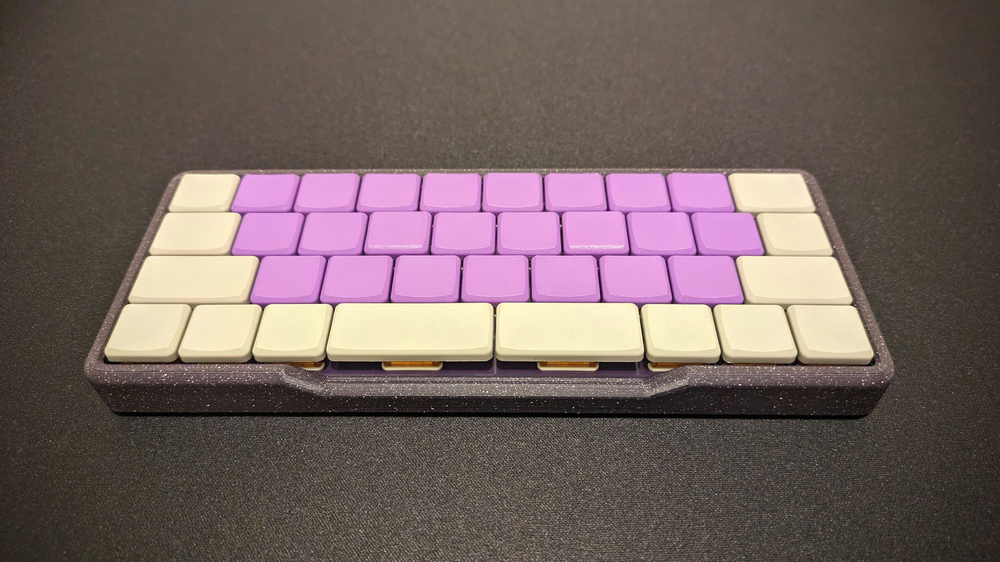

# Chaz

Low Profile, Choc Spaced QAZ-alike

## Features
* QAZ Layout
* Choc Spaced
* Integrated STM32F702 microcontroller

## Materials
* 1x [Chaz PCB](https://shop.hazel.cc/products/chaz-v03)
* 2x 2U Kailh Choc Stabalizers
* 37x Kailh Choc v1 Switches
* 37x Keycaps
  * 31x 1u 
  * 2x 1.25u
  * 1x 1.75u
  * 1x 1.5u
  * 1x 2u
  * 1x 2.25u
* 1x [Case](case/)
* 6x M2x6 countersunk screws  

## Build Steps
* Insert switches into switchplate
  * **NOTE**: There are 3 switches rotated differently from the rest.  Check the PCB to make sure you've got the correct orientation
* [Insert stabalizers](https://docs.keeb.io/choc-stabs)
* Place switchplate with switches onto PCB and press all the switches into their homes.
* Solder Switches
* Insert into case
* Screw Case to PCB from the bottom

## Firmware
To get into DFU, hold the DFU button on the bottom of the PCB while plugging in USB.

* [QMK](https://github.com/hazels-garage/qmk_firmware/tree/hazel/chaz)
* [VIAL](firmware/hazel_chaz_v03_vial.bin)
* ZMK Soon

## Changelog
* v0.3 - Current STM32F072CBT6 
* v0.2 - Unreleased and Unverified RP2040 
* v0.1 - Previously released ProMicro 
* v0.0 - Unreleased, but Verified ProMicro 